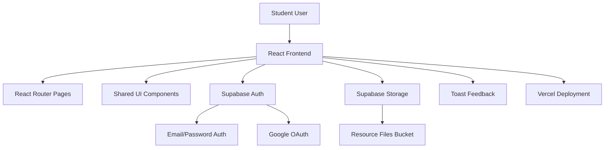
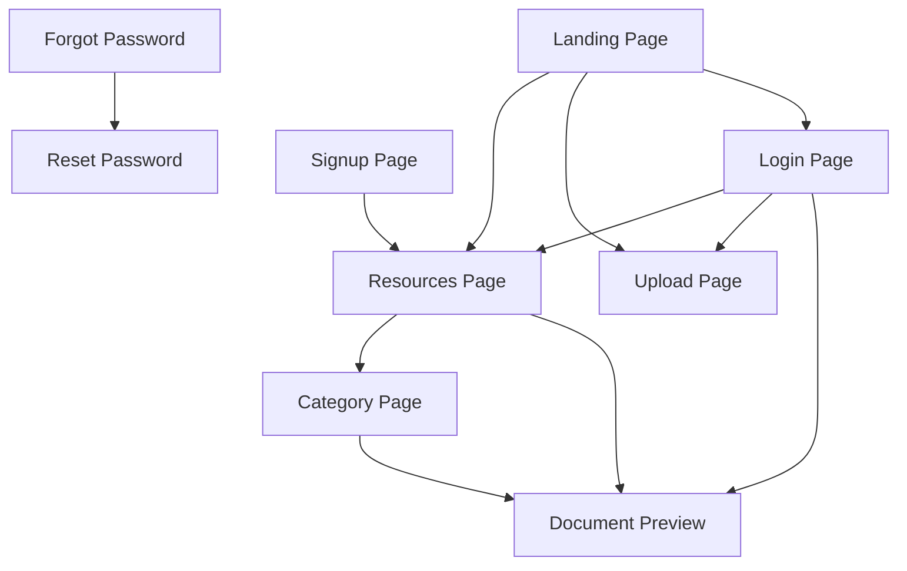
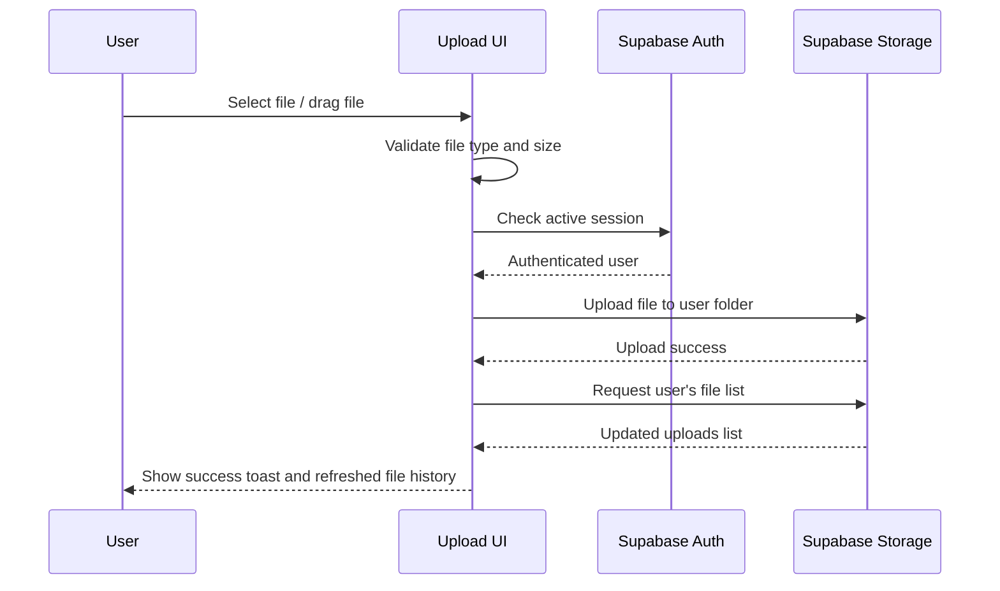
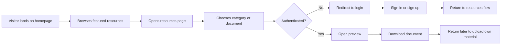

# Resource Library Project Documentation

## Chapter 1: Project Overview

### 1.1 Introduction
Resource Library is a student-focused web platform created to make academic materials easier to discover, access, and share. The main idea behind the project is to provide a clean digital space where students can browse useful educational files, preview selected documents, download files after authentication, and contribute their own learning materials to support others.

This project was built as a modern web application rather than a static resource page. Instead of showing files in a basic list, the system presents a structured multi-page experience with a landing page, category-driven discovery, protected document preview, upload capabilities, and authentication flows. The final result is a product that feels closer to a real education platform than a classroom file dump.

### 1.2 Project Aim
The goal of the project is to solve a common student problem: academic resources are often scattered across group chats, personal drives, or unstructured folders, making them hard to find and difficult to reuse. Resource Library addresses that by giving students one central location for shared study materials.

The platform was designed to:
- centralize useful academic content
- improve discoverability of study materials
- encourage peer-to-peer knowledge sharing
- make uploads easy for contributors
- protect premium actions like preview and download behind authentication
- provide a polished and trustworthy product experience

### 1.3 Target Users
The main users of the system are:
- secondary and tertiary students looking for notes, textbooks, and revision materials
- contributors who want to upload useful PDFs and study documents
- returning users who need a simple, organized way to retrieve academic materials

### 1.4 Project Scope
The implemented project includes:
- a branded landing page
- a resources browsing experience
- category-based resource exploration
- individual document preview flow
- user authentication with email/password and Google
- password reset and recovery pages
- file upload to cloud storage
- authenticated download flow
- a personal uploaded-files area for contributors

### 1.5 Live Deployment
The application is deployed on Vercel and made available as a live hosted product:

`https://resource-library-with-superbase-aut.vercel.app/`

This deployment serves as the public-facing version of the project and demonstrates that the application is not only locally functional but also production-presentable.

## Chapter 2: Product Vision and Core Features

### 2.1 Product Vision
The vision behind Resource Library is to create a warm, organized, and student-friendly academic platform where educational resources can be shared in a community-driven way. The platform is designed to make the learning process easier by reducing friction in discovering and distributing study materials.

The product is intentionally more polished than a basic school portal. It combines the feeling of a modern learning platform with the practicality of a shared resource repository.

### 2.2 Key Product Features

#### 2.2.1 Landing Page Experience
The landing page acts as the entry point into the product and introduces the purpose of the platform. It is made up of several sections that explain the product clearly while driving users into the main flows.

These sections include:
- a hero banner with strong messaging and calls to action
- a “how it works” section showing the main student journey
- dynamic library statistics
- trust indicators
- quick access shortcuts
- category cards
- featured resources
- frequently asked questions
- an upload call-to-action block

This structure makes the homepage serve both marketing and product-navigation purposes.

#### 2.2.2 Resource Discovery
The resources page is one of the central product areas. It allows users to:
- search for materials by title or author
- filter by category
- sort by recency or alphabetically
- view trending and recommended materials
- move between overview and category-driven browsing

The goal here is to reduce the time it takes a student to find a relevant document.

#### 2.2.3 Category-Based Organization
To avoid dumping all files into one generic list, the project organizes documents into four core categories:
- Educational
- Literature
- History
- Business & Career

Each category has:
- its own route
- a tailored headline and intro
- a category description
- grouped document rails

This makes the platform more readable and academically structured.

#### 2.2.4 Protected Preview and Download
One of the core decisions in the product was to allow public browsing while protecting deeper access.

The implemented access model is:
- browsing is public
- preview is protected
- download is protected
- upload is protected

This model supports discovery without completely opening all file actions to anonymous visitors.

#### 2.2.5 Upload Workflow
The upload feature allows authenticated users to add files into the shared library. The upload page supports:
- manual file selection
- drag-and-drop interaction
- title entry
- category assignment
- validation on supported formats
- upload size restriction
- display of previously uploaded files

This contributor flow supports the community-sharing vision of the product.

#### 2.2.6 Authentication System
The application includes a full authentication system built around Supabase. Users can:
- sign up with email and password
- sign in with email and password
- use Google OAuth
- request password reset
- set a new password
- sign out from the navigation menu

This gives the project a complete user lifecycle rather than just a one-page sign-in form.

## Chapter 3: System Design and Technical Architecture

### 3.1 Frontend Stack
The project is built with:
- React
- TypeScript
- Vite
- Tailwind CSS
- React Router
- Supabase JavaScript client
- shadcn-style UI component patterns
- toast notifications using a Sonner-like pattern

This stack supports fast development, clear component organization, and a responsive UI.

### 3.2 Application Structure
The project follows a modular frontend structure. The codebase is broken into reusable folders for pages, components, shared layout elements, data, types, and service logic.

Main structure areas include:
- `src/pages` for route-level screens
- `src/components/pages` for page-specific sections
- `src/components/shared` for shared navigation and footer
- `src/components/ui` for reusable interface primitives
- `src/lib` for Supabase, auth, and storage logic
- `src/data/resources` for seeded resource/category content
- `src/types` for shared TypeScript models

This structure helps the project scale as more pages and features are added.

### 3.3 Routing Design
The application uses client-side routing to create a multi-page experience. The key routes are:
- `/`
- `/resources`
- `/resources/:categorySlug`
- `/resources/preview`
- `/upload`
- `/login`
- `/signup`
- `/forgot-password`
- `/reset-password`

These routes support both public marketing and authenticated product flows.

### 3.4 Shared Layout System
The application includes a reusable base layout that wraps the main public routes with:
- sticky navbar
- footer
- scroll restoration helper

The navbar changes based on authentication state. It includes:
- desktop navigation links
- login call to action for guests
- user greeting/menu for authenticated users
- logout handling
- a mobile bottom navigation

This ensures consistent UX across pages.

### 3.5 Supabase Integration
Supabase is used for two major responsibilities:
- authentication
- file storage

The application expects environment variables for:
- `VITE_SUPABASE_URL`
- `VITE_SUPABASE_PUBLISHABLE_DEFAULT_KEY`

Email/password and Google authentication are handled through Supabase Auth, while uploaded files are stored and listed from Supabase Storage.

### 3.6 Storage Logic
The file storage system uses a shared bucket for uploaded documents. Files are saved under user-specific paths and named in a structured way using:
- timestamp
- category
- encoded title
- original file extension

This naming pattern helps the app recover metadata such as title and category from stored files later.

### 3.7 Inferred System Flow
The technical flow of the system can be summarized as:
- user visits the site
- public pages load without login
- auth state is checked in relevant components
- resource lists are built from storage bucket contents
- preview and download actions confirm session validity
- uploads are validated and sent to cloud storage
- UI refreshes to show the newly uploaded file

### 3.8 Architecture Diagram

## Chapter 4: Page-by-Page Implementation

### 4.1 Landing Page
The landing page is built to perform two roles:
- explain the product clearly
- move users into the core flows

It includes a large hero banner with background imagery, overlay treatment, strong academic messaging, and primary action buttons. Below that, the page introduces the product workflow, shows live library activity, explains trust factors, highlights categories, and surfaces featured resources.

This page is important because it converts a casual visitor into an active user.

### 4.2 Resources Page
The resources page acts as the main exploration hub. Instead of presenting data in a basic list, it offers multiple discovery modes. Users can search, filter, sort, and move between an overview view and a categories view.

The overview section contains:
- recommended documents
- category carousel
- multiple trending rails

The category view contains:
- a full category grid
- descriptive cards with route links

This design supports both quick browsing and intentional exploration.

### 4.3 Category Pages
Each category page gives a fuller identity to a subject area. Instead of only filtering a list, the category page behaves like a mini editorial section. It includes:
- breadcrumb navigation
- category headline
- introduction paragraph
- grouped document carousels
- longer “about category” explanation

This gives each category more meaning and helps students understand what kind of materials belong there.

### 4.4 Document Preview Page
The preview page is one of the most important protected screens in the product. It supports the main user intent of opening and examining a resource before downloading it.

The page layout is divided into:
- left metadata panel
- large preview center area
- right related-documents column

The logic checks:
- whether the user is authenticated
- whether a valid document parameter exists
- whether the file can be resolved from stored documents

If a preview URL exists, the file is embedded in an iframe. If not, the page gracefully falls back to a preview-unavailable state.

### 4.5 Upload Page
The upload page is designed for contributors. It includes:
- explanatory heading
- form-based metadata entry
- category selection
- drag-and-drop upload area
- authentication-gated file selection
- validation feedback
- uploaded-files history

This page is especially important because it turns the project from a read-only library into a community-powered platform.

### 4.6 Authentication Pages
The authentication screens are not plain forms. They are styled with:
- large image backgrounds
- dark gradient overlays
- glass-like cards
- polished form controls
- clear supporting text

This includes:
- login page
- signup page
- forgot password page
- reset password page

These screens help the app feel complete and trustworthy.

### 4.7 Route Relationship Diagram

## Chapter 5: Challenges Faced and How They Were Handled

### 5.1 Balancing Public Access and Protected Actions
One likely challenge in this project was deciding what should remain public and what should require login. If everything were public, the platform would lose control over access. If everything were private, discovery would become frustrating.

The chosen solution was a balanced model:
- visitors can browse categories and see the platform
- users must authenticate to preview, download, or upload

This created a smoother product funnel while still protecting core file actions.

### 5.2 Managing File Metadata Without a Separate Database Table
Another challenge was how to derive useful document information from uploaded files without first building a full custom database schema. The project appears to solve this by embedding useful metadata into storage object names and then reconstructing values such as title and category from the file path.

This is practical for an early-stage product, but it also introduces complexity around:
- parsing titles
- decoding encoded names
- handling category fallbacks
- inferring missing information

### 5.3 Handling File Preview Limitations
Not every uploaded file type supports rich inline preview the same way PDFs do. The project needed a graceful strategy for supported and unsupported preview states.

The implementation approach addresses this by:
- embedding preview when a usable document URL exists
- using a styled placeholder when preview is not possible
- keeping downloads available behind authentication

This avoids broken or confusing empty preview pages.

### 5.4 Keeping the UI Organized as the Project Grew
Because the platform includes many pages and multiple sections per page, one major challenge would have been avoiding a monolithic code structure. A single large component per page would quickly become difficult to maintain.

This was addressed by splitting the interface into many focused sections such as:
- landing page sections
- upload sections
- resources sections
- shared layout components
- UI primitives

That decision improved readability and maintainability.

### 5.5 Synchronizing Auth State Across the App
A subtle but important challenge in apps like this is keeping the UI in sync with authentication state. The navbar, preview logic, upload flow, and download actions all depend on whether the user is logged in.

The project handles this by:
- checking current session state
- listening to auth state changes
- updating visible actions accordingly

This reduces mismatches between what the interface shows and what the backend will allow.

### 5.6 Building a Product That Feels Real, Not Academic Only
A common issue in student projects is that the app works technically but still feels unfinished. Another challenge here was making the interface feel like a real product rather than a course submission.

This was addressed through:
- branded visual direction
- thoughtful landing page sections
- responsive layouts
- polished auth screens
- category narratives
- featured content and stats

These details add professionalism to the final result.

### 5.7 Upload Workflow Diagram

## Chapter 6: Evaluation, Lessons Learned, and Future Improvements

### 6.1 Project Outcome
Resource Library successfully demonstrates how a student-centered academic platform can be built with modern frontend architecture and cloud-backed services. The project goes beyond a basic React interface by including:
- real authentication
- real storage integration
- protected content flow
- a multi-page navigation structure
- reusable design patterns
- deployable public hosting

This makes it a strong portfolio-grade full-stack frontend project.

### 6.2 Lessons Learned
Several important lessons can be drawn from the project:

#### 6.2.1 Good UX Matters as Much as Core Logic
Even when the technical functions work, users still need guidance, structure, and confidence. The landing page, auth design, and organized categories show the importance of presentation and flow.

#### 6.2.2 Modular Code Structure Helps Large Interfaces
Breaking a project into smaller page sections and shared UI pieces makes the codebase easier to reason about and extend.

#### 6.2.3 Cloud Services Speed Up Product Development
Using Supabase for authentication and storage made it possible to focus on product behavior instead of building every backend capability from scratch.

#### 6.2.4 Realistic Constraints Improve Product Thinking
Handling restrictions such as authentication rules, upload size limits, and file format validation helped shape the project into something more practical and credible.

### 6.3 Suggested Future Improvements
If the project continues, the following additions would make it even stronger:
- user profiles
- favorites and bookmarks
- comment or review system for documents
- moderation workflow for uploads
- faculty/department filters
- course code search
- admin dashboard
- analytics for popular files
- document ratings
- personalized recommendations
- upload approval workflow
- richer metadata per file

### 6.4 Final Reflection
Resource Library is a well-scoped but ambitious project that combines UI design, frontend engineering, authentication, storage integration, and user experience thinking into one system. It reflects a move away from simple page-building into actual product development.

The project stands out because it is not only visually polished, but also structured around real user actions:
- browse
- search
- authenticate
- preview
- download
- contribute

That makes it a strong example of building a meaningful, student-centered digital product.

### 6.5 User Journey Diagram

